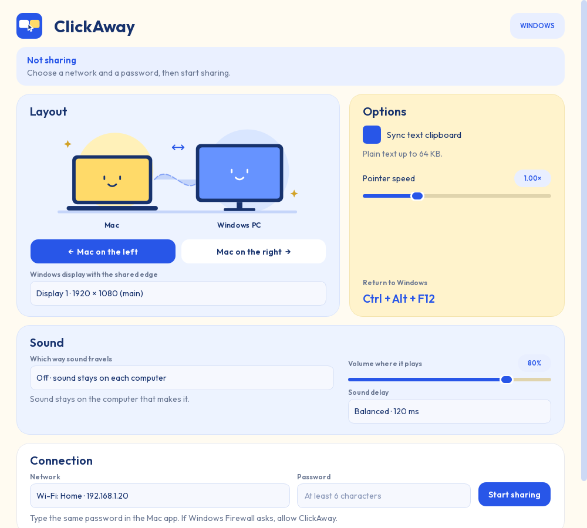
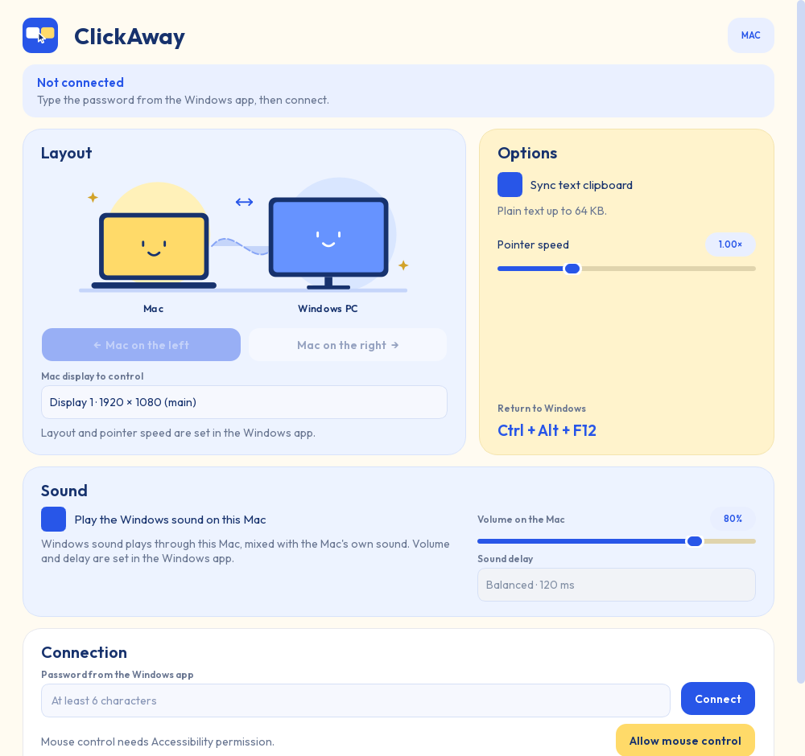

<p align="center"></p>

# ClickAway

Use your Windows mouse on the Mac next to it. Move the pointer past the shared
screen edge to control the Mac, and move it back to return to Windows. Plain text
copied on one computer can be pasted on the other, and either computer's sound can
play through the other, so a game on Windows and a video on the Mac are heard
together in whichever pair of headphones you are wearing. The computers connect
directly over your local network.

ClickAway is made for a Windows 11 PC and an Apple Silicon Mac.



## Features

- Mouse movement, left, right and middle clicks, double-clicks, dragging, scrolling
  and extra mouse buttons (whether extra buttons do anything depends on the Mac app).
- Mac on the left or right of the PC. Pick the display with the shared edge on
  Windows and the display to control on the Mac.
- Adjustable pointer speed for different screen sizes and Retina scaling.
- Plain-text clipboard sync in both directions, up to 64 KiB per copy. It can be
  turned off on either computer, and only copies made after connecting are synced.
- Sound sent either way and mixed with what the receiving computer is already
  playing, with a volume slider and a choice of delay. Pick the direction in the
  Windows app; the Mac can refuse. Sound never delays the mouse: a chunk that cannot
  be sent at once is dropped instead.
- **Ctrl + Alt + F12** on the Windows keyboard returns the pointer immediately.
- Pairing with a password you choose. The password never crosses the network: it is
  checked with SPAKE2 inside a TLS connection, so each connection attempt can test
  only one guess. No account, cloud service or telemetry.
- On disconnect, held Mac mouse buttons are released and Windows input is restored.

## Download

Get both installers from the [latest GitHub release](https://github.com/ElMariones/ClickAway/releases/latest):

- **Windows 11 (x64):** `ClickAway-Setup-x64.exe`. Run it and follow the wizard. It
  installs for your user only, so there is no administrator prompt, and it adds a
  Start Menu shortcut and an entry in Installed apps for removing it later.
- **Mac with Apple Silicon (M1 or newer):** `ClickAway-macOS-AppleSilicon.dmg`. Open
  it and drag ClickAway onto the Applications folder shown in the window, then open
  ClickAway from Applications. It runs natively on arm64.

These are development builds, so each one asks for confirmation the first time.
Windows SmartScreen may need **More info → Run anyway**. The Mac app is ad-hoc signed
and **not Apple-notarized**, so macOS blocks the first launch: open System Settings →
Privacy & Security and click **Open Anyway** next to ClickAway.

If you would rather not use an installer, `ClickAway-Windows-x64.zip` and
`ClickAway-macOS-AppleSilicon.zip` contain the same apps as plain folders. On the Mac,
still move `ClickAway.app` into Applications yourself: opened from Downloads or from
the disk image, macOS forgets its Accessibility permission on every launch.

`SHA256SUMS.txt` on the release page lets you verify any download. Install the same
version on both computers; versions with different pairing protocols can't connect.

Builds of every commit to `main` are also kept for 30 days as
[GitHub Actions artifacts](https://github.com/ElMariones/ClickAway/actions/workflows/build.yml)
(zipped once more by GitHub). You can also build from source using the instructions below.

## Setup

### 1. On Windows

1. Install ClickAway with `ClickAway-Setup-x64.exe`, connect both computers to the
   same network, and open ClickAway from the Start Menu.
2. Under **Layout**, choose **Mac on the left** or **Mac on the right**, and pick the
   Windows display whose edge faces the Mac.
3. Under **Connection**, pick the network the Mac is on. Wi-Fi networks are listed by
   name, followed by this PC's IP address on that network.
4. Under **Sound**, choose which way sound travels: **Off**, **This PC → Mac** to
   hear Windows on the Mac, or **Mac → this PC** to hear the Mac in the headphones
   plugged into the PC. Set the volume and delay there too. Nothing is sent until a
   Mac is connected.
5. Type a password of at least 6 characters and click **Start sharing**.
6. If Windows Firewall asks, allow ClickAway. If Windows treats your Wi-Fi as a
   *Public* network, allow public networks too, or set the network to *Private* in
   Settings → Network & internet → Wi-Fi → your network. ClickAway uses TCP and UDP
   port 49624.

### 2. On the Mac

1. Open `ClickAway-macOS-AppleSilicon.dmg` and drag ClickAway onto the Applications
   folder in that window. Opening the app straight from the disk image or from
   Downloads makes macOS forget its Accessibility permission on every launch.
2. Open ClickAway from Applications. Click **Allow mouse control** and turn on
   ClickAway in System Settings → Privacy & Security → Accessibility. If you
   installed an earlier ClickAway build before, remove its entry from that list
   first — see the troubleshooting table if the permission doesn't stick.
3. Pick the Mac display to control.
4. Under **Sound**, leave **Allow sound sharing on this Mac** on, or clear it to keep
   sound off this Mac entirely. To send the Mac's sound to the PC, click **Allow sound
   recording**, turn ClickAway on in System Settings → Privacy & Security → Screen &
   System Audio Recording, then quit ClickAway and open it again: macOS only applies
   that permission to a fresh launch. It is the only way macOS lets an app share the
   sound it is playing, which is why a sound permission asks about screen recording.
5. Type the same password and click **Connect**. If macOS asks to find devices on
   your local network, allow it, then click **Connect** again.
6. ClickAway looks for the PC automatically. If it isn't found, a **Windows IP
   address** field appears. Type the address shown in the Windows app's status
   (for example `192.168.1.20`) and connect again.



### 3. Using it

Move the pointer past the shared edge of the Windows display to control the Mac, and
back across the Mac's edge to return. The pointer keeps its relative height. Press
**Ctrl + Alt + F12** on Windows to return immediately.

Copy plain text on either computer and paste it on the other with that computer's
keyboard. The keyboard itself stays with its own computer. Both apps can be
minimized; closing either one ends the connection.

With **Sound** set to a direction, everything one computer plays is copied to the
other and mixed with what that one is already playing, so listen on the receiving
computer. Sound travels one way at a time, which is what keeps it from echoing back.

With **This PC → Mac**, the PC keeps playing through its own speakers as well. Turn
the Windows volume all the way down to silence them: what the Mac receives is taken
before that volume knob and stays at full strength. With **Mac → this PC**, the Mac
also keeps playing its own sound, so turn the Mac's volume down instead. ClickAway
never captures its own playback, so the sound cannot loop around.

Use **Low · 60 ms** when sound and picture must line up and the network is good, or
**Safe · 250 ms** on busy Wi-Fi where sound breaks up.

If the connection drops, click **Connect** on the Mac again; the password keeps
working while Windows is sharing. Stopping sharing ends it. After 10 wrong password
attempts, Windows stops sharing until you start it again.

## Troubleshooting

| Problem | What to check |
| --- | --- |
| The Mac can't find the Windows PC | Both computers on the same network, sharing is on, and Windows Firewall allows ClickAway (including public networks if your Wi-Fi is set to Public). Guest Wi-Fi, client isolation and some VPNs stop devices from seeing each other. Typing the PC's IP address skips the search. |
| Wrong password | Passwords are case-sensitive. Spaces at the start and end are ignored. |
| Sharing stopped on its own | 10 wrong password attempts stop sharing. Click **Start sharing** again. |
| Connected but the Mac doesn't click | Turn on Accessibility for the exact ClickAway app you are running. After replacing an unsigned build, remove the old Accessibility entry and add the new app if necessary. |
| macOS keeps asking for Accessibility even though ClickAway is already checked in the list | The checked entry is stale: it was granted to a previous build's unsigned signature, or the app is running from a randomized, translocated path because it was never moved into Applications. Quit ClickAway completely (check Activity Monitor too), remove every "ClickAway" row from System Settings → Privacy & Security → Accessibility using **−**, confirm `ClickAway.app` is inside `/Applications`, then reopen it and grant access again from the fresh prompt. If the checkbox still doesn't stick, run `tccutil reset Accessibility io.github.elmariones.clickaway` in Terminal (with ClickAway closed) and try once more. |
| The pointer doesn't cross | Choose the correct Windows display and side; release held mouse buttons and move a little inward before crossing again. |
| Movement is too fast or slow | Adjust **Pointer speed** on Windows; physical PC pixels and Mac display points differ. |
| No sound on the receiving computer | Check the direction in the Windows app and that **Allow sound sharing on this Mac** is on. The sending computer must actually be playing something, since ClickAway copies sound that already exists. Check the receiving computer's own output device and volume. |
| The Mac won't send its sound | macOS needs **Screen & System Audio Recording** permission for ClickAway, and only applies it after the app is reopened: grant it in System Settings → Privacy & Security, then quit ClickAway and open it again. macOS may also remind you now and then that an app is recording; that reminder is macOS's, and ClickAway throws the picture away and keeps only the sound. |
| Sound breaks up or crackles | Choose a longer **Sound delay** on Windows. Wi-Fi with a weak signal drops chunks; sound is dropped rather than delaying the mouse. Stereo sound uses about 1.5 Mbit/s. |
| Sound lags behind the picture | Choose **Low · 60 ms**. Some delay always remains; the network and the Mac's own audio buffer both add to it. |
| Sound stops after changing headphones | ClickAway follows the sending computer's new default output device on its own within a few seconds. If it doesn't, set **Which way sound travels** to **Off** and back again. |
| The clipboard doesn't sync | Turn it on on both computers, copy new plain text after connecting, and keep it under 64 KiB. Images and files aren't supported. |
| Displays changed | Connect again after changing resolution, arrangement or monitors. Sharing pauses when a display change is detected. |
| The shortcut can't be registered | Close another ClickAway instance or an app using Ctrl+Alt+F12, then start sharing again. |

## Current scope and validation

This is **v0.5.1**, intended for a two-computer desk. The target setup is Windows 11
25H2 and macOS Tahoe on an Apple Silicon Mac. Windows input hooks, network listing,
discovery, pairing, protocol integration and automated tests are verified on the
development PC. Physical mouse crossing, Mac permissions and behavior on a specific
macOS build require hands-on testing with both computers; a successful build alone
does not prove them.

- One Windows host and one paired Mac per session; IPv4 local networking.
- The Mac finds the PC with a UDP broadcast. Networks that block broadcasts need the
  IP address typed in.
- One selected display per computer for crossings; left/right layouts only.
- No keyboard sharing, rich-text/image/file clipboard, file dragging between
  computers, Bluetooth transport, internet relay or automatic startup.
- Sound travels one direction at a time, chosen in the Windows app. Windows copies
  what it plays with WASAPI loopback; the Mac uses ScreenCaptureKit, which is why it
  asks for Screen & System Audio Recording and must be reopened once after you grant
  it. The Mac's sound capture needs macOS 13 or newer.
- Sound is uncompressed 16-bit stereo at the sending computer's own sample rate,
  taken from its default output device and mixed down to two channels. Per-app
  selection, microphone input and both directions at once are out of scope.
- A held-button drag stays on its current computer; release before crossing.
- The Windows cursor is parked while controlling the Mac; hiding it is best effort
  because individual Windows apps can reset their cursor shape.
- Login screens, UAC/secure desktops, games using raw/exclusive input, and protected
  macOS surfaces are not supported. Stop sharing before locking either computer.
- Clipboard changes within the 650 ms polling interval can coalesce. If both
  computers copy simultaneously, arrival order wins; copy the text again.
- No independent security audit or latency benchmark has been performed.

## Run from source

Use Python 3.12 or newer. Build each app on its own operating system.

Windows (PowerShell):

```powershell
git clone https://github.com/ElMariones/ClickAway.git
cd ClickAway
py -3.12 -m venv .venv
.\.venv\Scripts\python.exe -m pip install -e ".[build]"
.\.venv\Scripts\python.exe -m clickaway
```

Mac (Terminal, native Apple Silicon Python):

```sh
git clone https://github.com/ElMariones/ClickAway.git
cd ClickAway
python3 -m venv .venv
.venv/bin/python -m pip install -e '.[build]'
.venv/bin/python -m clickaway
```

Build the distributable archive with `python scripts/build.py` from that virtual
environment. It appears under `dist/`. The GitHub workflow builds Windows x64 and
macOS arm64 separately; pushing a version tag such as `v0.5.0` also publishes both
archives as a GitHub release. Shipping a notarized Mac build requires an Apple
Developer signing identity and notarization credentials, which are not stored in this repo.

## Development

```sh
python -m unittest discover -s tests -v
python -m clickaway --preview
python -m clickaway --preview-mac
python scripts/render_preview.py
python scripts/make_icons.py
python scripts/make_dmg_background.py
```

The preview commands cannot capture the mouse or open a network listener. The render
script draws the actual Qt widgets to `docs/images/`. The icon script regenerates
`logo.ico` and `logo.icns` from `logo.svg` and needs Pillow; the background script
redraws the disk image artwork in `packaging/`.

`scripts/build.py` also builds the installer for the platform it runs on: the Windows
wizard with [Inno Setup](https://jrsoftware.org/isinfo.php) (`packaging/clickaway.iss`,
skipped when Inno Setup isn't installed) and the Mac disk image with
[dmgbuild](https://dmgbuild.readthedocs.io) (`packaging/dmg_settings.py`).

See [Architecture](docs/architecture.md), [Manual acceptance checks](docs/testing.md)
and [third-party notices](THIRD_PARTY_NOTICES.md).

### API references

The native adapters use [Windows low-level mouse hooks](https://learn.microsoft.com/en-us/windows/win32/winmsg/lowlevelmouseproc),
[GetAdaptersAddresses](https://learn.microsoft.com/en-us/windows/win32/api/iphlpapi/nf-iphlpapi-getadaptersaddresses),
[WlanQueryInterface](https://learn.microsoft.com/en-us/windows/win32/api/wlanapi/nf-wlanapi-wlanqueryinterface)
and [Apple Quartz mouse events](https://developer.apple.com/documentation/coregraphics/cgevent/init(mouseeventsource:mousetype:mousecursorposition:mousebutton:)).
Sound is captured with [WASAPI loopback recording](https://learn.microsoft.com/en-us/windows/win32/coreaudio/loopback-recording)
on Windows and [ScreenCaptureKit](https://developer.apple.com/documentation/screencapturekit/capturing-screen-content-in-macos)
on the Mac, and played through [QAudioSink](https://doc.qt.io/qt-6/qaudiosink.html).
Pairing follows [SPAKE2 (RFC 9382)](https://www.rfc-editor.org/rfc/rfc9382) over the
[RFC 3526](https://www.rfc-editor.org/rfc/rfc3526) 2048-bit group. The interface uses
Qt and the [Outfit typeface](https://github.com/google/fonts/tree/main/ofl/outfit).
